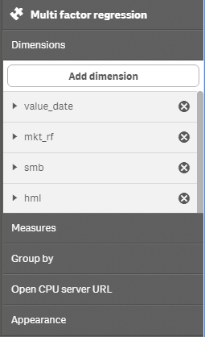
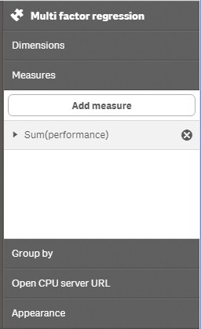
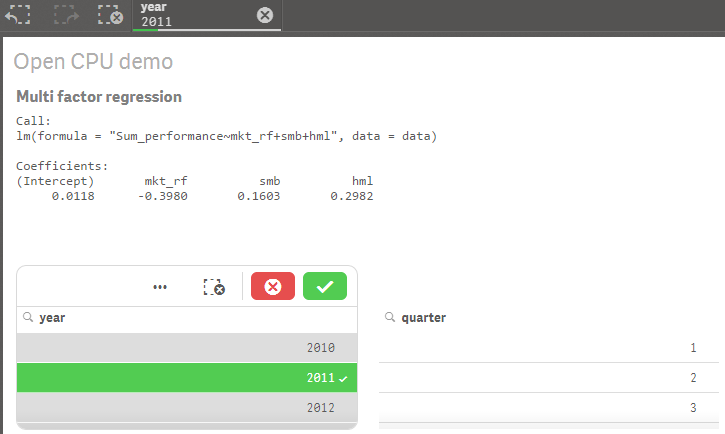

# qlik-sense-r-regression-extension

> Simple proof of concept Qlik Sense Extension to connect a Qlik Sense hypercube to an [Open CPU R web service](https://www.opencpu.org/).

The extension creates a regression formula based on the Qlik Sense hypercube, and passes the formula and the contents of the hypercube to the R function [lm()](http://www.rdocumentation.org/packages/stats/functions/lm) on an Open CPU web service.

As of now, the visualisation of the results is somewhat bare-bones (and now I'm being generous).

# Installation

Download and unpack, then follow [these steps](http://help.qlik.com/sense/2.0/en-US/developer/#../Subsystems/Extensions/Content/Howtos/deploy-extensions.htm%3FTocPath%3DBuilding%2520visualization%2520extensions%7CWorking%2520with%2520visualization%2520extensions%7C_____9).

#Using the module

Select the dimensions you would like to use for the regression. Since the hypercube aggregates on the dimensions, it is possible to indicate that one dimension is a grouping dimension. In that case it will not be included in the regression model.

| Explanatory variables | Grouping parameter (ignored dimension) |
| ---------- | -------- |
|||

Select the measure on which you want to run the regression. Since Sense wants an aggregation function on measures, there's a bit of name scrubbing in the background to avoid confusing R (all non-alphanumeric characters are replaced with underscore _).



Given the parameters chosen in the screenshots above, the extension will generate the following regression formula to pass to R:

```
Sum_performance ~ mkt_rf + smb + hml
```

Choose an Open CPU server. For testing purposes, I suppose you could use the public server on https://public.opencpu.org, but you really, *really*, **_really_** should set up your own server should you decide to use this for anything more than playing with the interface. The screenshot below shows the extension pointing to a local server running the Open CPU service.


If the stars are aligned, and your parameters are correctly set up, you should get something looking a bit like this:


Dead sexy, ya? Since we're talking to the hypercube, you can select dimensions in the Sense model, and a new R call with the reduced data set will be sent to the web service for re-execution. 



#Limitations

The data extraction from the hypercube isn't very robust at the moment. If you send off millions of rows, you're unlikely to get the result you expect. See todo list.

#Demo

There's a simple [.qvf file in the demo folder](demo/R demo.qvf) in the repository, which includes a small dataset and a setup that runs a three factor regression.

#To do

* There's room for making the presentation a bit nicer. To put it mildly.
* It might be interesting to send the factors back as parameters to the Sense model, so they could be used elsewhere.

# Thanks to

* [Jeroen Ooms](https://github.com/jeroenooms) for [Open CPU](https://www.opencpu.org/) and [opencpu.js](https://github.com/jeroenooms/opencpu.js).
* [Stefan Walther](https://github.com/stefanwalther) for [qliksense-extension-tutorial](https://github.com/stefanwalther/qliksense-extension-tutorial).
* Jeff Koch, who presented session [T60 Integrating Qlik with R (link required Qlik partner login)](https://eu1.salesforce.com/sfc/#version?selectedDocumentId=069D0000002TA38) at [Qonnections 2015](http://www.qlik.com/us/landing/qonnections-2015), which showed that this was possible and provided pointers to Open CPU.
* [Speros Kokenes](https://github.com/skokenes) for [senseUtils.js](https://github.com/skokenes/senseUtils).

# Disclaimer

Unsupported and provided as is. Feedback is appreciated.
