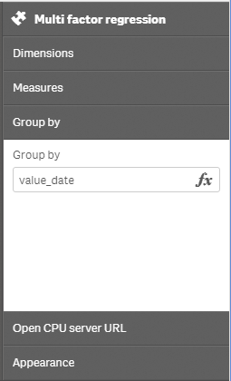
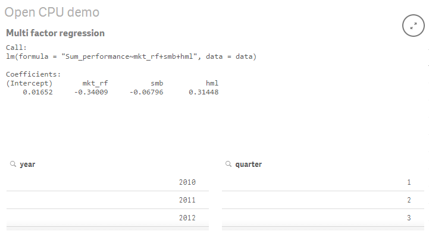

# qlik-sense-r-regression-extension

> Simple proof of concept Qlik Sense Extension to connect a Qlik Sense hypercube to an Open CPU R web service.

The extension creates a regression formula based on the Qlik Sense hypercube, and passes the formula and the contents of the hypercube to the R function lm() on an Open CPU web service.

As of now, the visualisation of the results is bare-bones at best (and now I'm being generous).

#Using the module

Select the dimensions you would like to use for the regression. Since the hypercube aggregates on the dimensions, it is possible to indicate that one dimension is a grouping dimension. In that case it will not be included in the regression model.

Select the measure on which you want to run the regression. Since Sense wants an aggregation function on measures, there's a bit of name scrubbing in the background to avoid confusing R.

If the stars are aligned, and your parameters are correctly set up, you should get something looking a bit like this:

Dead sexy, ya? Since we're talking to the hypercube, you can select dimensions in the Sense model, and a new R call with the reduced data set will be sent to the web service for re-execution. 

#Limitations

The data extraction from the hypercube isn't very robust at the moment. If you send off millions of rows, you're unlikely to get the result you expect. See todo list.

#To do

* There's room for making the presentation a bit nicer. To put it mildly.
* It might be interesting to send the factors back as parameters to the Sense model, so they could be used elsewhere.
* Using skokenes' [senseUtils](https://github.com/skokenes/senseUtils) to grab the hypercube would be smart.

# Thanks to

* [Jeroen Ooms](https://github.com/jeroenooms) for [Open CPU](https://www.opencpu.org/) and [opencpu.js](https://github.com/jeroenooms/opencpu.js).
* [Stefan Walther](https://github.com/stefanwalther) for [qliksense-extension-tutorial](https://github.com/stefanwalther/qliksense-extension-tutorial)

# Disclaimer

Unsupported and provided as is. Feedback is appreciated. Hire 